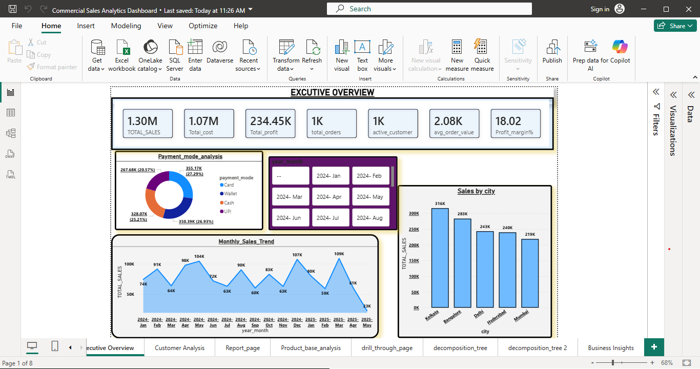
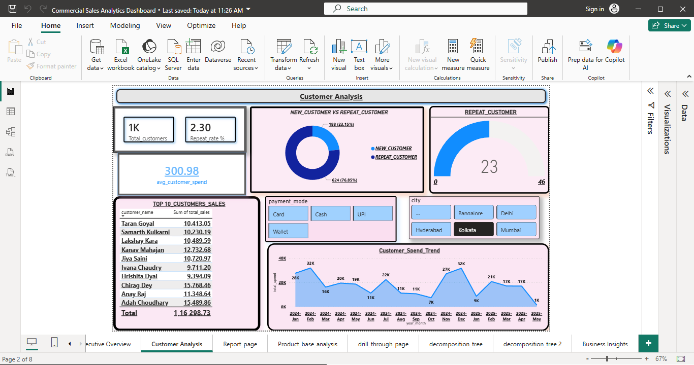
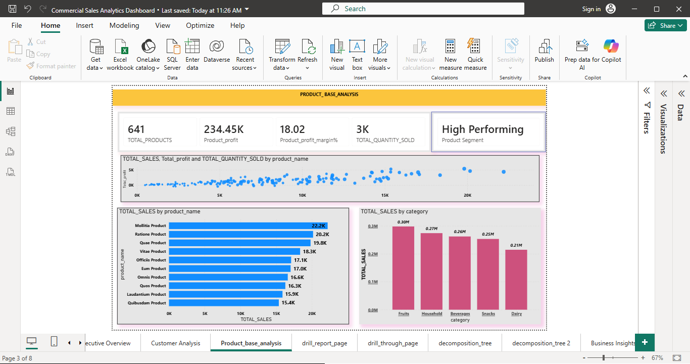
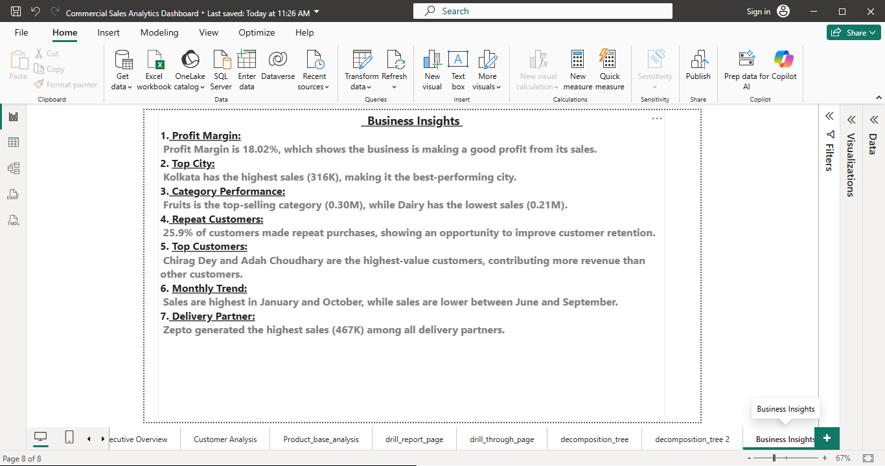

# Commercial Sales Analytics Dashboard

## Project Overview
This project analyzes commercial sales data to uncover insights into sales performance, customer behavior, product performance, and delivery partner efficiency using SQL and Power BI.

## Tools Used
- Power BI
- SQL
- Excel

## Key Features
- KPI Cards
- Sales Trend Analysis
- Customer Analysis
- Product Analysis
- Drill Through Pages
- Tooltips
- Decomposition Tree
- Interactive Filters and Slicers

## Dashboard Pages

1. Executive Overview
2. Customer Analysis
3. Product-Based Analysis
4. Drill Report Page
5. Customer Drill Through Page
6. Decomposition Tree Analysis
7. Decomposition Tree 2 Analysis
8. Business Insights

## Key KPIs
- Total Sales
- Total Orders
- Profit Margin %
- Average Order Value (AOV)
- Repeat Customers %
- Delivery Performance

## Business Insights
- Identified top-performing products and categories.
- Analyzed customer purchasing behavior and repeat customer trends.
- Evaluated delivery partner performance across different metrics.
- Tracked monthly sales trends and business growth.
- Highlighted key areas for operational improvement.

## Dashboard Preview

## Project Outcome
This dashboard helps business stakeholders monitor performance, identify growth opportunities, and make data-driven decisions.
